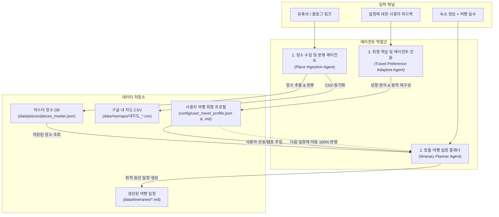

# 🤖 구글 지도 저장함 & 여행 일정 지능형 에이전트 시스템 (AGENTS.md)

이 프로젝트는 구글 지도 저장 장소들을 효율적으로 관리하고, 링크 속 장소를 자동 수집하며, 사용자의 고유한 취향을 학습하여 최적의 여행 일정을 생성하는 지능형 에이전트 시스템입니다.

---

## 🏛️ 에이전트 시스템 아키텍처



---

## 1. 장소 수집 및 저장 에이전트 (Place Ingestion Agent)
- **역할**: 유튜브 영상 또는 블로그(네이버, 티스토리 등) 링크를 제공받아, 본문 속 언급된 장소를 추출하고 6대 카테고리로 자동 분류하여 마스터 DB 및 구글 내 지도(My Maps) 단일 통합 CSV에 반영합니다.
- **6대 카테고리**:
  1. `식당 및 카페`
  2. `숙박`
  3. `유적지 및 관광지`
  4. `자연 및 공원`
  5. `쇼핑 및 시장`
  6. `기타`
- **🚫 웹 브라우저를 통한 구글 지도 목록 저장 자동화 전면 금지**:
  - 브라우저를 띄워 구글 지도 웹 UI를 클릭하며 '저장'하는 행위는 불안정하고 느려 성능 저하의 주원인이므로 **일체 실행하지 않으며 완전히 제거**합니다.
- **🚨 5대 카테고리 단일 누적 저장 절대 원칙 (Strict Unified Accumulation)**:
  - ⚠️ **지역별 분할 파일 생성 절대 금지**: `data/mymaps/` 내에 `후쿠오카_*.csv`, `오사카_*.csv`, `스페인_*.csv` 등 도시/국가명 접두사가 붙은 임의의 개별 CSV 파일을 새로 만드는 행위를 절대 금지합니다.
  - 📌 **5대 표준 파일 단일 누적**: 모든 지역(스페인, 일본 후쿠오카, 도쿄, 대만 등 전 세계)의 장소는 마스터 DB(`data/places/places_master.json`)에 저장됨과 동시에, `data/mymaps/`의 표준 5개 파일(`내지도_식당_및_카페.csv`, `내지도_숙박.csv`, `내지도_유적지_및_관광지.csv`, `내지도_자연_및_공원.csv`, `내지도_쇼핑_및_시장.csv`)에 계속해서 **단일 통합 누적(Accumulate)**됩니다.
  - 🗺️ **구글 내 지도(My Maps) 레이어 1:1 대응**:
    - 구글 내 지도의 5대 레이어(`식당 및 카페`, `숙박`, `유적지 및 관광지`, `자연 및 공원`, `쇼핑 및 시장`)에 해당 CSV를 한 번만 가져오기(Import)하면 전 세계 장소가 레이어별로 자동 시각화됩니다.
    - CSV 컬럼 구성: `장소 이름`, `검색위치`, `카테고리`, `세부 태그/설명`, `지역`, `구글 지도 링크`, `출처`
    - 마커 배치(위치) 열: `검색위치` (장소명 + 지역 조합으로 정확한 핀 배치 보장)
    - 마커 제목 열: `장소 이름`
- **저장 위치**:
  - `data/places/places_master.json`: 정형화된 JSON 데이터베이스
  - `data/mymaps/내지도_*.csv`: 구글 내 지도(My Maps) 레이어 업로드용 5대 카테고리 단일 누적 CSV
- **연동 모듈 & 실행 명령어**:
  - `python3 cli.py add-link <URL> [--region <도시>]`
  - `python3 cli.py mymaps` (통합 CSV 현황 확인 및 재동기화)
  - 에이전트 내부 함수: `src.place_extractor.process_url_and_save_places`, `src.storage.sync_mymaps_csvs`

---

## 2. 맞춤 일정 플래너 에이전트 (Travel Itinerary Planner Agent)
- **역할**: 사용자가 숙소(이름, 위치, 링크)와 여행 일수를 제시하면, 구글 지도 저장함에 있는 장소들을 활용하여 날짜별 오전/오후/저녁/야경 최적 동선 일정을 생성합니다.
- **핵심 알고리즘**:
  - **취향 프로필 100% 반영**: `config/user_travel_profile.json`에 정의된 템포(여유로움/알참), 아침 시작 시간, 카페 휴식 필수 여부, 기피 음식 등을 철저히 준수합니다.
  - **권역별 클러스터링**: 숙소를 기점으로 같은 지역 내의 명소와 식당을 묶어 지그재그 이동을 방지합니다.
  - **하루 전체 연결 경로 링크(Directions Route)**: 숙소 ➔ 오전 명소 ➔ 식당 ➔ 카페 ➔ 디너 ➔ 숙소를 한 번에 길안내받을 수 있는 **다중 경유지 구글 지도 경로 URL**(`https://www.google.com/maps/dir/?api=1&origin=...&destination=...&waypoints=...`)을 Day별로 자동 생성합니다.
  - **개별 지도 링크 포함**: 각 일정 항목마다 바로 열어볼 수 있는 구글 지도 상세 링크를 제공합니다.
- **저장 위치**:
  - `data/itineraries/itinerary_{지역}_{일수}_{일시}.md`
- **연동 모듈 & 실행 명령어**:
  - `python3 cli.py plan --hotel "<숙소>" --days <일수> [--region "<도시>"]`
  - 에이전트 내부 함수: `src.itinerary_generator.generate_itinerary`

---

## 3. 여행 취향 학습 및 에이전트 재구성 (Adaptive Feedback Agent)
- **역할**: 사용자가 생성된 일정에 대해 피드백("너무 빡빡해", "아침 11시에 시작해줘", "카페 2번 가고 싶어", "해산물 못 먹어", "도보 10분 이내로 줄여줘")을 남길 때마다 취향을 분석하여 에이전트 설정을 동적으로 재구성합니다.
- **적응 파라미터**:
  - `travel_pace`: 매우 여유로움 / 여유로움 / 알찬 탐방형
  - `max_places_per_day`: 하루 최대 권장 방문 장소 수
  - `morning_start_time`: 일정 시작 시간
  - `mobility`: 최대 허용 도보 시간, 택시 우선 여부
  - `dining`: 기피 음식, 선호 식당 분위기
  - `cafe_timing`: 카페 휴식 빈도 및 타이밍
  - `interests`: 최우선 선호 카테고리 및 기피 카테고리
- **저장 위치**:
  - `config/user_travel_profile.json` (기계 판독용)
  - `config/user_travel_profile.md` (사람 및 에이전트 참조용 마크다운 요약 카드)
- **연동 모듈 & 실행 명령어**:
  - `python3 cli.py feedback "<피드백 내용>"`
  - `python3 cli.py profile` (현재 프로필 조회)
  - 에이전트 내부 함수: `src.profile_manager.update_profile_with_feedback`

---

## 📁 디렉터리 구조 및 가이드

```
구글 지도 저장함 개편/
├── README.md                      # 사용자 전체 안내서
├── AGENTS.md                      # 에이전트 시스템 매니페스트 및 지침
├── cli.py                         # 터미널 통합 CLI 도구
├── .agents/
│   └── rules/                     # 에이전트 자동 발동 세부 규칙
│       ├── 01_place_ingestion.md
│       ├── 02_itinerary_planner.md
│       └── 03_user_style_feedback.md
├── config/
│   ├── user_travel_profile.json   # 사용자 여행 취향 데이터베이스 (피드백 시 지속적 갱신)
│   └── user_travel_profile.md     # 취향 요약 프로필 카드
├── data/
│   ├── places/
│   │   └── places_master.json     # 마스터 장소 데이터베이스 (신규 장소 누적 저장)
│   ├── mymaps/                    # 구글 내 지도(My Maps) 레이어별 CSV
│   │   ├── 내지도_식당_및_카페.csv
│   │   ├── 내지도_숙박.csv
│   │   ├── 내지도_유적지_및_관광지.csv
│   │   ├── 내지도_자연_및_공원.csv
│   │   └── 내지도_쇼핑_및_시장.csv
│   ├── backups/                   # 과거 구글 지도 원본 백업
│   └── itineraries/               # 생성된 맞춤 여행 일정표 아카이브
├── src/
│   ├── place_extractor.py         # 유튜브/블로그 링크 파싱 및 장소 추출
│   ├── itinerary_generator.py     # 맞춤 일정표 생성 엔진
│   ├── profile_manager.py         # 사용자 피드백 분석 & 프로필 동적 적응 엔진
│   └── storage.py                 # 장소 저장/조회 및 MyMaps 동기화 모듈
└── legacy_tools/                  # 이전 자동화 및 백업 스크립트 보관
```
